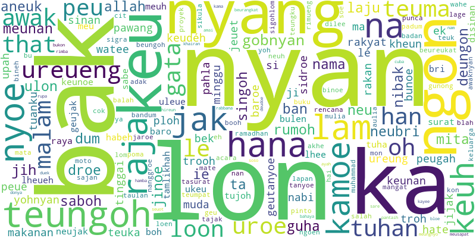

## Kelompok I :

 
word embedding dari korpus Aceh USK dg TF-IDF (1K)

   
## 🗃️ Contributor

|     |      Github   | Additional Learning  |
| :-: |  :------------------: | ------------------------------- |
| 00  |    [Ruski](https://github.com/mrusqy)          | [Learn More] |
| 01  |    [Doni](https://github.com/donisumito)       | [Learn More] |
| 02  |    [Habib](https://github.com/habibasymuhyi) | [Learn More] |
| 03  |    [Muttaqin](https://github.com/muttaqinavg)  | [Learn More] |
| 04  |    [Iskandar](https://github.com/Linggeh)      | [Learn More] |
| 05  |    [Saryulis](https://github.com/saryulis137)  | [Learn More] |

